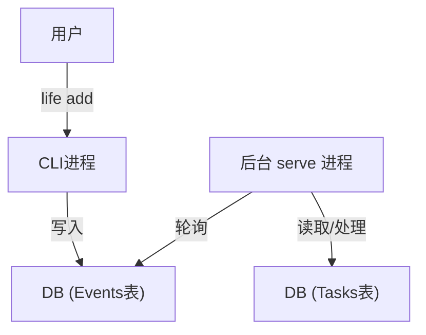
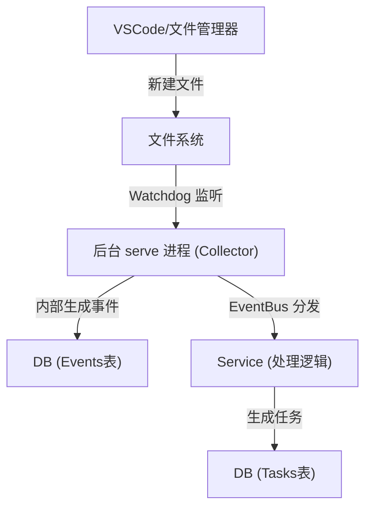

# 系统运行机制详解 (System Mechanism)

本文档详细解释 LifeOS 的底层运行原理、进程模型以及如何实现“后台自动化”。

## 1. 核心概念：双进程模型

为了实现解耦，LifeOS 采用了**“前台指令 + 后台大脑”**的双进程设计。

### 1.1 前台进程 (The Trigger)
*   **命令**: `life add`, `life done`, `life list`
*   **生命周期**: **瞬时**。用户敲回车启动，命令执行完立即退出。
*   **职责**:
    1.  接受用户输入。
    2.  **生成事件 (Event)** 并写入数据库 (DB)。
    3.  **不**直接执行耗时逻辑（如 AI 分析）。
    4.  *(解耦体现)*: 它根本不知道后台有没有人在处理，它只管“发消息”。

### 1.2 后台进程 (The Brain / `life serve`)
*   **命令**: `life serve`
*   **生命周期**: **常驻**。一直运行，直到被杀死或关机。
*   **职责**:
    1.  **轮询事件**: 每隔 N 秒（默认 10s）检查数据库的 `events` 表。
    2.  **消费事件**: 发现 `processed=False` 的事件，根据类型（如 `task.created`, `file.created`）分发给对应的 Service 处理。
    3.  **定时任务**: 通过 `APScheduler` 触发定时逻辑（如每日回顾）。
    4.  **文件监控 (即将实现)**: 挂载 `Watchdog` 线程，实时监听文件系统变动。

---

## 2. 自动化流程图解

### 场景 A：手动添加 (当前)


### 场景 B：文件自动感知 (理想目标)


**关键点**: 在场景 B 中，**用户不需要运行任何 `life` 命令**。只要 `life serve` 在后台跑着，它就能自动感知世界并作出反应。

---

## 3. `life serve` 的技术实现

`serve` 命令本质上是启动了一个聚合了多个“监听器”的容器。

```python
# 伪代码示意
def serve():
    # 1. 启动定时器调度器
    scheduler.start()
    
    # 2. (下一步) 启动文件监控线程
    # observer.schedule(event_handler, path, recursive=True)
    # observer.start()
    
    # 3. 启动主循环 (事件消费)
    while True:
        events = bus.fetch_unprocessed()
        for event in events:
            dispatch(event)
        sleep(5)
```

### 如何保证持续运行？
目前我们提供了 `life_system.utils.process.detach_and_run`，它利用操作系统的特性（Windows 的 `DETACHED_PROCESS` 或 Linux 的 `setsid`），让 Python 进程脱离当前终端窗口在后台独自运行。

**未来增强**:
为了防止进程意外挂掉，生产环境中通常会使用操作系统级的服务管理器：
*   **Windows**: 注册为 Windows Service 或使用 Task Scheduler (开机自启)。
*   **Linux**: 使用 Systemd 或 Supervisor。

---

## 4. `life` 命令的入口机制 (Entry Points)

你之所以能在任意位置敲 `life`，是因为 `setup.py` 中的配置：

```python
entry_points={
    "console_scripts": [
        "life=life_system.interfaces.cli:app",
    ],
},
```

当你运行 `pip install -e .` 时：
1.  pip 读取这个配置。
2.  在 Python 的 `Scripts/` 文件夹下生成一个 `life.exe` 垫片文件。
3.  这个 exe 会自动找到你的 Python 解释器并运行 `life_system.interfaces.cli.app` 函数。

这也是为什么你修改代码后不需要重新编译——exe 只是个入口，它每次都去加载最新的 Python 源码。
