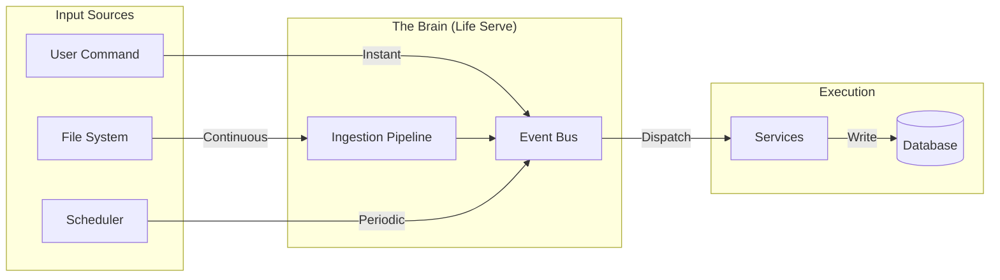

# 系统运行机制与架构哲学 (System Mechanism & Philosophy)

## 1. 核心哲学：全能选手与社区平台

**LifeOS 不是一个单一的工具，而是一个平台。**

`life serve` 是这个社区里的"全能选手"（The All-Rounder）。它像一个不知疲倦的守护者，无时无刻不在后台运行。

### 它的角色：
1.  **监视者 (Observer)**: 它拥有无数双眼睛（Collectors），监视着文件系统、时间、网络、甚至剪贴板。
2.  **调度者 (Dispatcher)**: 它维护着一个核心队列（Event Bus），将收集到的信息有序地排列。
3.  **执行者 (Executor)**: 它像推土机一样，将积压的事件推送到数据库，并分发给不同的专业工具（Services/Engines）去处理。
4.  **记录者 (Recorder)**: 它确保所有的结果最终都持久化到数据库，保持系统的状态持续更新。

---

## 2. 架构层级：从收集到沉淀

LifeOS 的运行机制可以看作是一条从无序到有序的数据流水线。

### 2.1 收集层 (Collectors) - "它的眼睛"
**定位**: 可插拔的感知模块。
**Watchdog** 只是众多 Collector 中的一种。任何能够产生信号的东西都可以是 Collector。
- **File Watcher**: 监听文件变动。
- **Time Trigger**: 监听时间（Cron）。
- **Web Clipper**: 监听浏览器行为（未来）。
- **Email Listener**: 监听邮件（未来）。

**关键点**: Collectors 只负责"发现"，不负责"思考"。

### 2.2 摄入层 (Ingestion Pipeline) - "它的免疫系统"
**定位**: 系统的重整化不动点。
**职责**: 
- **去噪**: 过滤掉无效的信号（如临时文件、重复操作）。
- **标准化**: 将五花八门的信号统一转化为标准的 `Event`。
- **持久化去重**: 确保物理世界未变时，系统保持静默。

### 2.3 核心层 (The Brain) - "它的神经中枢"
- **Event Bus**: 消息的高速公路。
- **Scheduler**: 心跳控制器，驱动整个系统按部就班地运行。
- **Lock**: 确保只有一个大脑在思考（单实例机制）。

### 2.4 服务层 (Services) - "它的手脚"
具体的业务逻辑在这里执行：
- 把 Event 变成 Task。
- 自动归档旧任务。
- 发送提醒。

### 2.5 存储层 (Storage) - "它的记忆"
- **SQLite (life.db)**: 最终的事实来源。
- **Logs**: 系统的潜意识流。

---

## 3. 数据流向：推土机模式

无论是前台的 `life add` 还是后台的 `File Watcher`，本质上都是在向这条流水线投料。

**解耦的极致**:
- **前台**只管投料（生成 Event），投完就走，不等待结果。
- **后台**像推土机一样，持续地、异步地处理这些 Event，将它们推平、压实，变成数据库里整齐的 Task。

---

## 4. 为什么需要单实例锁？

既然 `life serve` 是社区的全能选手，那么一个社区（操作系统）里只能有一个全能选手。
如果有两个 `life serve` 同时运行：
1.  它们会抢着处理同一个文件变动（竞争条件）。
2.  它们会同时写入数据库（锁冲突）。
3.  它们会重复发送提醒。

因此，我们在底层实现了 **Single Instance Lock**，确保你的 Windows 系统中，始终只有一个 LifeOS 大脑在运行。
