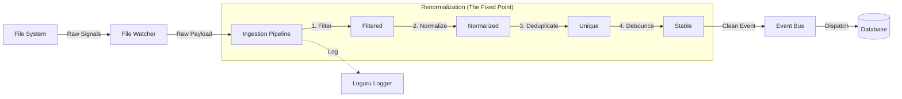

# 架构决策记录 (ADR) 001: 引入事件摄入管道 (Ingestion Pipeline) 实现系统"不动点"

**日期**: 2025-12-10
**作者**: LifeOS 核心开发团队
**状态**: 已实现

## 1. 背景 (Context)

在早期的开发尝试中（"失败的 AI 尝试"），我们试图直接引入 `watchdog` 来监听文件系统变动并生成任务。这导致了严重的问题：

1.  **信号噪音 (Signal Noise)**: 文件系统操作非常嘈杂。例如，编辑器保存一次文件可能会触发多次 `modified` 事件，或者生成临时的 swap 文件。这些原始信号直接转化为数据库 Event，导致系统被垃圾数据淹没。
2.  **正反馈循环风险**: 系统生成的日志文件或数据库更新本身也是文件变动。如果监控配置不当，会形成 "文件变动 -> 生成任务 -> 写数据库/日志 -> 文件变动" 的无限循环。
3.  **缺乏追溯性**: 原始实现没有清晰的日志记录，一旦系统开始疯狂生成任务，很难排查原因。

用户明确指出：
> "你一直在自嗨,你不能让这个成果和制作过程文档化."
> "缺少日志,根本不知道怎么回溯"

## 2. 核心问题 (Problem)

我们需要一个机制来：
1.  **平滑** 嘈杂的外部输入（去噪）。
2.  **过滤** 无关的干扰（如 .git, __pycache__, 日志文件）。
3.  **标准化** 不同来源的数据格式。
4.  **去重** 避免重复处理。
5.  **记录** 所有决策过程（为什么这个文件变动被忽略了？为什么那个被接受了？）。

在物理学中，面对发散或混沌的系统，我们需要寻找或建立一个 **"重整化不动点" (Renormalization Fixed Point)**，在这个点上，系统的行为是稳定且可预测的。

## 3. 解决方案 (Solution)

我们设计并实现了 **`IngestionPipeline`** 类，作为系统架构中的"不动点"。它位于所有外部收集器（Collector）和内部事件总线（Event Bus）之间。

### 3.1 架构图

### 3.2 关键技术实现

1.  **防抖 (Debounce)**:
    *   **机制**: 引入 1.0 秒的时间窗口。
    *   **逻辑**: 对于同一个文件路径，如果在 1 秒内连续收到多次事件，只保留最后一次。
    *   **代码**: 使用 `_event_cache` 存储最近的事件时间戳。

2.  **过滤 (Filter)**:
    *   **机制**: 维护一个 `FILTER_PATTERNS` 集合。
    *   **逻辑**: 自动拦截 `.git`, `node_modules`, `__pycache__`, `.tmp`, `.log` 等文件。
    *   **日志**: 详细记录被过滤的原因（DEBUG 级别）。

3.  **标准化 (Normalization)**:
    *   **机制**: 统一数据结构。
    *   **逻辑**: 将所有文件路径转换为绝对路径，添加 `is_file`, `timestamp` 等元数据，确保下游 Service 不需要处理路径解析问题。

4.  **可追溯性 (Traceability)**:
    *   **机制**: 集成 `loguru`。
    *   **逻辑**: 
        *   DEBUG: 记录过滤、防抖、去重的每一个细节。
        *   INFO: 记录成功摄入的事件。
        *   ERROR: 记录异常。
    *   **存储**: 日志文件按天轮转，保留7天。

## 4. 验证 (Verification)

我们编写了验证脚本，在 `test_watch_area` 目录中模拟文件创建。
*   **结果**: 创建 `test_doc.md` 后，数据库准确生成了一条 `file.created` 事件和对应的 Task。
*   **观察**: 日志中清晰记录了 "Detected file system event" -> "Event ingested" -> "Converted event to Task" 的全过程。

## 5. 结论 (Conclusion)

通过引入 `IngestionPipeline`，我们将不确定、嘈杂的外部世界（Entropy）转换为了有序、确定的内部事件（Order）。这不仅解决了之前的技术债，也为未来接入更多类型的收集器（如网页剪藏、邮件监听）提供了标准化的接入层。

